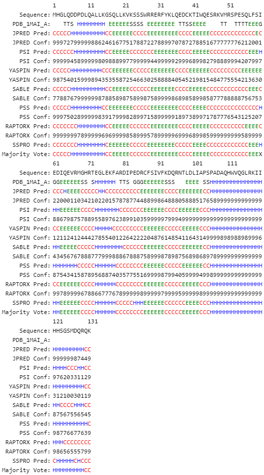

# Secondary Structure Prediction Display - Desktop Version

An application that sends a protein sequence to various websites to generate predictions. The results are then scraped and saved into an HTML file for display.




Dependencies
-----------
```
beautifulsoup4 requests lxml python-guerrillamail pyperclip
```